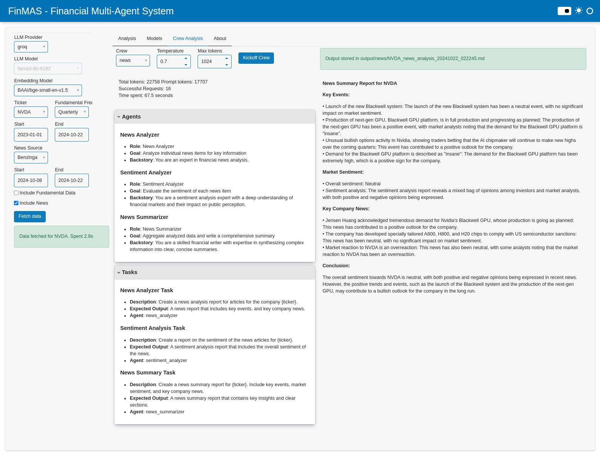
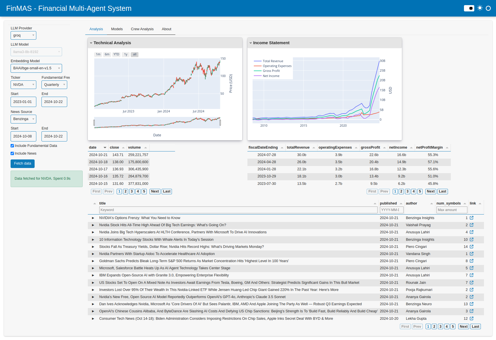

---
hide:
    - navigation
---

# FinMAS - Financial Analysis Multi-agent System

This app uses LLM agents organized in a multi-agent system to analyze financial data
and perform financial tasks. The app is developed during the final capstone project of the
[WorldQuant MSc in Financial Engineering](https://www.wqu.edu/mscfe).

It is meant as a practical and educational app that demonstrates the state-of-the-art of LLM models applied
to tasks in the financial domain, and with an extra focus on open source models and packages.

Please visit [GitHub repo](https://github.com/KevorkSulahian/agentic-llm-for-better-results) for further information.

The following screenshots illustrate a news analysis crew output and the main dashboard.

### News analysis

### Main dashboard

